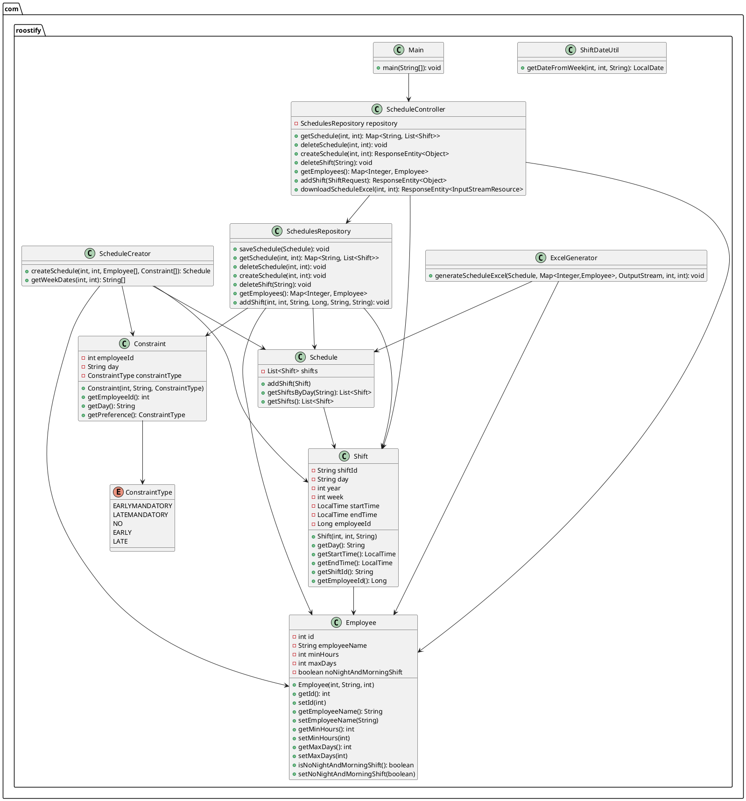

```plantuml
This is a UML class diagram representing the architecture of the Java Scheduling System.

Last updated: 2025-09-07

@startuml
package com.roostify {

    class Constraint {
        - int employeeId
        - String day
        - ConstraintType constraintType
        + Constraint(int, String, ConstraintType)
        + getEmployeeId(): int
        + getDay(): String
        + getPreference(): ConstraintType
    }

    enum ConstraintType {
        EARLYMANDATORY
        LATEMANDATORY
        NO
        EARLY
        LATE
    }

    class Employee {
        - int id
        - String employeeName
        - int minHours
        - int maxDays
        - boolean noNightAndMorningShift
        + Employee(int, String, int)
        + getId(): int
        + setId(int)
        + getEmployeeName(): String
        + setEmployeeName(String)
        + getMinHours(): int
        + setMinHours(int)
        + getMaxDays(): int
        + setMaxDays(int)
        + isNoNightAndMorningShift(): boolean
        + setNoNightAndMorningShift(boolean)
    }

    class ExcelGenerator {
        + generateScheduleExcel(Schedule, Map<Integer,Employee>, OutputStream, int, int): void
    }

    class Schedule {
        - List<Shift> shifts
        + addShift(Shift)
        + getShiftsByDay(String): List<Shift>
        + getShifts(): List<Shift>
    }

    class Shift {
        - String shiftId
        - String day
        - int year
        - int week
        - LocalTime startTime
        - LocalTime endTime
        - Long employeeId
        + Shift(int, int, String)
        + getDay(): String
        + getStartTime(): LocalTime
        + getEndTime(): LocalTime
        + getShiftId(): String
        + getEmployeeId(): Long
    }

    class ScheduleCreator {
        + createSchedule(int, int, Employee[], Constraint[]): Schedule
        + getWeekDates(int, int): String[]
    }

    class ShiftDateUtil {
        + getDateFromWeek(int, int, String): LocalDate
    }

    class SchedulesRepository {
        + saveSchedule(Schedule): void
        + getSchedule(int, int): Map<String, List<Shift>>
        + deleteSchedule(int, int): void
        + createSchedule(int, int): void
        + deleteShift(String): void
        + getEmployees(): Map<Integer, Employee>
        + addShift(int, int, String, Long, String, String): void
    }

    class ScheduleController {
        - SchedulesRepository repository
        + getSchedule(int, int): Map<String, List<Shift>>
        + deleteSchedule(int, int): void
        + createSchedule(int, int): ResponseEntity<Object>
        + deleteShift(String): void
        + getEmployees(): Map<Integer, Employee>
        + addShift(ShiftRequest): ResponseEntity<Object>
        + downloadScheduleExcel(int, int): ResponseEntity<InputStreamResource>
    }

    class Main {
        + main(String[]): void
    }

    Constraint --> ConstraintType
    Schedule --> Shift
    Shift --> Employee
    ExcelGenerator --> Schedule
    ExcelGenerator --> Employee
    ScheduleCreator --> Schedule
    ScheduleCreator --> Constraint
    ScheduleCreator --> Employee
    ScheduleCreator --> Shift
    SchedulesRepository --> Schedule
    SchedulesRepository --> Employee
    SchedulesRepository --> Shift
    SchedulesRepository --> Constraint
    ScheduleController --> SchedulesRepository
    ScheduleController --> Employee
    ScheduleController --> Shift
    Main --> ScheduleController
}
@enduml
```